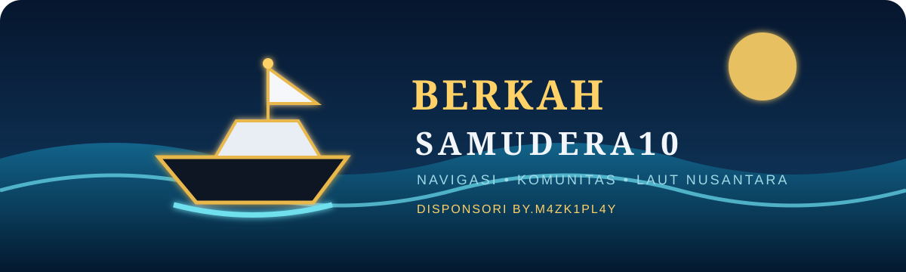

<p align="center"></p>

<h1 align="center">Berkah Samudera10</h1>
<p align="center"><b>Navigasi laut, operasi kapal, komunitas nelayan, AI suara Jarvis, dan informasi maritim dalam satu APK.</b></p>

<p align="center">
  <a href="https://github.com/jambudio336-hue/berkah-samudera10/releases/latest"></a>
  <a href="CHANGELOG.md"></a>
  <a href="LICENSE"></a>
</p>

> **Disponsori by.m4zk1pl4y** — dibuat untuk membantu nelayan dan pelaut Indonesia. Banner animasi di atas menampilkan kapal, ombak, dan identitas aplikasi.

## Akses awal dan mode pengguna biasa

Saat pertama kali aplikasi dibuka, pengguna dapat memilih **Daftar/Masuk Akun** untuk mengaktifkan profil, follow, lokasi teman, dan Story, atau memilih **Lanjut sebagai Pengguna Biasa** untuk memakai navigasi, cuaca, catatan, Al-Qur’an, dan fitur lokal tanpa akun.

## Rilis terbaru — 1.0.32

Release 1.0.32 membawa **Ocean Command Center**, Jarvis v2 berbasis OpenRouter, mode keselamatan MOB/SOS, Marine Risk Score, mode tampilan malam/HUD, dan cache offline terbaru. API key tetap harus dimasukkan oleh pengguna dan tidak disertakan di source code.

## Download APK

[**Download APK Release Terbaru**](https://github.com/jambudio336-hue/berkah-samudera10/releases/latest)

Atau buka halaman [Releases](https://github.com/jambudio336-hue/berkah-samudera10/releases) dan pilih asset `berkah-samudera10-release.apk`.

## Ocean Command Center dan keselamatan

- Quick mode **Navigation, Weather, Fishing, HUD, dan AI Briefing** untuk mengubah fokus dashboard tanpa memalsukan data provider.
- **Marine Risk Score** lokal berdasarkan status GNSS, akurasi, koneksi, dan pergerakan kapal. Skor ini adalah indikator bantuan, bukan sertifikasi kondisi pelayaran.
- Mode tampilan **Ocean Dark, Red Night, dan Blackout** untuk mengurangi gangguan visual saat operasi malam.
- **MOB** menyimpan titik manusia jatuh ke laut setelah konfirmasi pengguna. **SOS** menyiapkan pesan berisi koordinat, kecepatan, dan waktu untuk disalin/dikirim pengguna.
- MOB/SOS tidak melakukan panggilan otomatis, tidak mengendalikan kapal, dan tidak menggantikan prosedur darurat resmi.

## Marine Toolkit, Windy, background tracking, dan update

- Windy global dengan pilihan layer laut/cuaca yang diperluas: angin, gust, hujan, akumulasi hujan, gelombang, swell, wind waves, arus, arus pasang, suhu laut, suhu udara, titik embun, kelembapan, awan, kabut, CAPE, tekanan, visibilitas, dan satelit. Windy menyediakan 40+ layer pada Map Forecast API; sebagian layer/model bergantung pada produk dan ketentuan Windy.
- Marine Toolkit offline untuk konversi satuan, perhitungan BBM + cadangan, jarak/bearing, dan penyalinan koordinat GPS.
- Android foreground tracking untuk pemantauan kapal saat aplikasi tidak sedang dibuka, dengan persistent state dan restart setelah reboot/app replacement jika diizinkan Android.
- Google Play In-App Updates untuk distribusi Play.
- GitHub Release updater untuk APK sideload; Android tetap mengontrol izin dan konfirmasi instalasi.
- Release production wajib memakai signing certificate yang sama; private keystore tidak disimpan di repository.

## Fitur utama

### 🤖 Jarvis Voice Captain Assistant
- Voice assistant Bahasa Indonesia dengan input suara dan output Speech Synthesis perangkat.
- OpenRouter `openrouter/free` sebagai router model gratis yang dapat berubah sesuai ketersediaan provider.
- Membaca snapshot konteks Marine OS terbaru saat pertanyaan diajukan: GNSS, jaringan, modul, provider, status tracking, telemetry UI, dan data lokal yang aman untuk dibagikan.
- Tidak mengarang posisi, AIS, radar, kedalaman, cuaca, harga, atau data kapal.
- Mode percakapan tetap read-only; tindakan berisiko tidak dijalankan otomatis.
- Tombol **Cari model gratis** mengambil katalog OpenRouter dan memfilter model dengan harga prompt/completion nol; `openrouter/free` tetap menjadi fallback router.
- Riwayat percakapan disimpan lokal dan dapat dihapus dari Pengaturan.
- Fitur suara bergantung pada dukungan Speech Recognition/Speech Synthesis Android WebView/perangkat.
- Jangan masukkan API key OpenRouter ke repository atau log aplikasi.

### Navigasi dan data laut
- GPS/GNSS HP dengan lat/lon, akurasi, heading, rute, dan kecepatan knot.
- Peta global Leaflet dengan mode standar, satelit, topografi, medan, gelap, nautika, bathymetry GEBCO, mode 3D visual, serta tombol Google Maps yang mengikuti koordinat GPS.
- Router titik saat ini ke tujuan dengan jarak, kecepatan, dan estimasi tiba.
- Kedalaman GEBCO indikatif, objek karang/terumbu/batu/kapal karam dari data publik dalam radius hingga 1 km, serta peringatan akurasi untuk keselamatan.
- Cuaca laut, angin, ombak, hujan, radar, dan indikasi badai.
- Kompas 3D dengan sensor perangkat dan fallback heading GPS.
- Panel Windy global responsif dengan menu embed resmi, pusat GPS otomatis, angin, ombak, hujan, tekanan, suhu, dan prakiraan waktu.

### Komunitas online Supabase
- Login email OTP, SMS OTP, channel WhatsApp OTP, dan Google OAuth.
- Profil Nahkoda/ABK, bio, foto profil URL, nama kapal, dan muatan.
- Pencarian pengguna berdasarkan nama akun atau nama kapal.
- Follow/unfollow, daftar pengikut, jumlah followers/following, dan lokasi teman yang saling follow.
- Batas maksimal **5.000 pengikut per akun** yang ditegakkan di aplikasi dan database.
- Supabase Realtime untuk posisi, notifikasi, data operasi, story, dan view story.

### Story 24 jam
- Story teks, foto, dan video maksimal **60 detik**.
- Menu Al-Qur’an menampilkan seluruh 114 surat; tiap surat memuat Arab, latin, arti, dan tombol putar audio langsung.
- Story hanya muncul pada pengguna yang saling follow.
- Media disimpan di bucket privat Supabase Storage.
- Riwayat tontonan mencatat akun yang menonton story.

### Operasi kapal dan spiritual
- Catatan tangkapan dengan pilihan jenis ikan.
- Catatan kolekting, BBM, logistik, dan kru dengan riwayat edit/hapus.
- Jadwal sholat mengikuti zona waktu lokasi, notifikasi, quotes Islami/pelaut, dan suara adzan.
- Al-Qur’an online 114 surat dengan Arab, latin, terjemahan, dan audio.
- QRIS donasi di Pengaturan serta ucapan terima kasih dan sponsor.

## Supabase dan OTP

Project sudah menggunakan Supabase. APK **tidak meminta pengguna membuat akun aplikasi terpisah**, tetapi pengguna yang ingin memakai profil, follow, lokasi teman, dan Story perlu login melalui Supabase Auth.

Provider yang perlu diaktifkan di Supabase Dashboard:

1. **Email Provider** untuk Email OTP. Template email harus memakai `{{ .Token }}` jika ingin kode OTP, bukan hanya magic link.
2. **Phone/SMS Provider** untuk OTP SMS.
3. **Twilio WhatsApp** untuk tombol OTP WhatsApp. WhatsApp tidak dapat mengirim OTP tanpa sender/provider WhatsApp yang valid.
4. **Google OAuth** dengan Client ID, Client Secret, dan redirect URL project.

## GPS/GNSS dan lokasi terkini

- Tekan **Izinkan akses lokasi**, berikan lokasi presisi, lalu buka Peta atau Dashboard untuk melihat latitude, longitude, akurasi, kecepatan, dan heading terkini.
- Untuk tracking ketika aplikasi berada di latar belakang: buka **Pengaturan → Mulai Tracking 24/7**, berikan izin lokasi **Izinkan sepanjang waktu**, dan izinkan notifikasi bila diminta Android.
- Android dapat membatasi background service karena baterai, izin, mode hemat daya, atau sinyal GPS. UI menampilkan posisi terakhir dan waktu update; posisi stale tidak boleh dianggap live.
- Koordinat disimpan lokal untuk operasi dan dapat dikirim ke sinkronisasi Supabase jika konfigurasi/izin jaringan tersedia.

## Akurasi dan keselamatan

- Koordinat berasal dari GNSS HP, bukan GPS satelit khusus atau citra satelit.
- Kedalaman GEBCO dan deteksi karang bersifat indikatif; bukan pengganti sonar, peta navigasi resmi, atau keputusan keselamatan pelayaran.
- Hasil kosong pada deteksi karang tidak berarti area bebas karang.
- Data online memerlukan internet; cache lokal tetap digunakan untuk data operasi dan tampilan yang sudah tersimpan.

## Privasi, API key, dan provider

- API key OpenRouter dimasukkan langsung oleh pengguna dan tidak ditanam dalam APK, repository, atau dokumentasi.
- Jangan memasukkan API key, token, password, atau data rahasia ke issue, log, screenshot, atau commit.
- Data provider komersial seperti Garmin, MarineTraffic/Kpler, Navionics, radar hardware, NMEA, dan AIS berlisensi hanya aktif jika kredensial/SDK resmi tersedia. Status **LIVE-READY** bukan klaim bahwa provider tersebut sedang online.
- Data publik, peta, tile, forecast, dan layanan sosial mengikuti lisensi, atribusi, rate limit, dan ketentuan masing-masing penyedia.

## Build dari source

```bash
npm install
npx cap sync android
./build-release.sh
```

APK release berada di `Berkah-Samudera10-release.apk`. Build membutuhkan Android SDK, Java 21, Gradle wrapper, dan keystore release.

## Struktur singkat

- `index.html` — UI dan halaman aplikasi.
- `js/map.js` — peta, GPS, rute, overlay, dan marker kapal.
- `js/supabase-sync.js` — Realtime, posisi, operasi, dan cache online.
- `js/auth.js` — Auth, profil, pencarian, follow, follower, dan lokasi teman.
- `js/story.js` — Story, upload media, viewer history, dan feed mutual follow.
- `android/` — wrapper Capacitor Android.
- `CHANGELOG.md` — riwayat perubahan release dan catatan versi.
- `js/jarvis-openrouter.js` — Jarvis voice AI, konteks Marine OS, model gratis OpenRouter, dan riwayat percakapan.
- `js/marine-command.js` — quick modes, Marine Risk Score, mode visual, MOB, dan SOS preparation.
- `LICENSE` — lisensi MIT dan pemberitahuan layanan pihak ketiga.

## Lisensi dan atribusi

Kode dirilis di bawah [MIT License](LICENSE). Data dan layanan pihak ketiga mengikuti ketentuan masing-masing penyedia: Supabase, OpenStreetMap/OpenSeaMap, GEBCO, Esri, BMKG, Open-Meteo, Aladhan, EQuran, dan Windy.

Terima kasih sudah menggunakan **Berkah Samudera10**. Semoga nyaman, aman, dan bermanfaat untuk perjalanan laut Anda.
